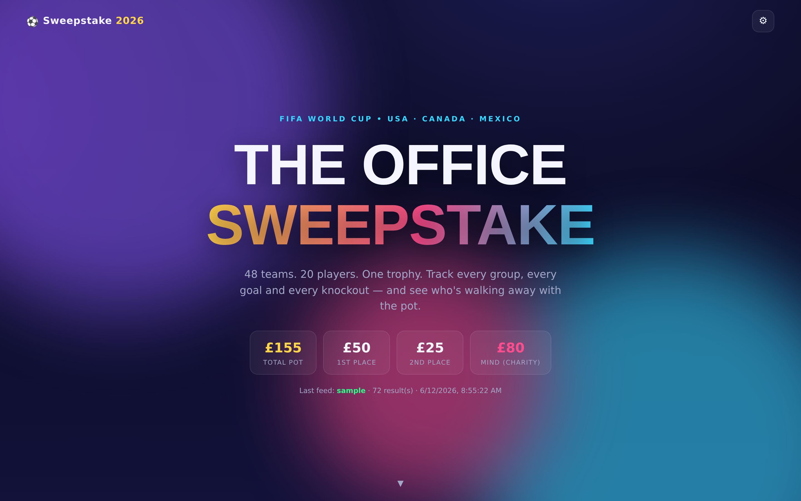

# 🏆 World Cup 2026 Sweepstake

A delightful, animated web app for the team's FIFA World Cup 2026 sweepstake —
rebuilt from the original Excel workbook into a small Python backend and a
GSAP-powered frontend, ready to deploy on **Replit**.

- **Group tables** that compute exactly like the spreadsheet (points, GD, GF,
  ranking and tie-breaks).
- **Best third-placed teams** and a full **knockout bracket** from the Round of
  32 to the Final.
- A **leaderboard** of the 20 players and how their teams are doing, plus the
  prize pot (£50 / £25 / £80 to MIND).
- A **results feed** that automatically pulls scores and populates the backend.
- A **unit-test suite that replicates the spreadsheet's logic**, including
  parity tests that check the engine against the workbook itself.



---

## How it maps to the spreadsheet

The original workbook (`data/World_Cup_sweepstake.xlsx`, sheet *Tracker*) drives
everything. The logic lives in [`wcsweepstake/engine.py`](wcsweepstake/engine.py),
a dependency-free module where each function names the formula it reproduces:

| Spreadsheet | Code |
|---|---|
| `Played` = `IF(AND(Home<>"",Away<>""),1,"")` | `engine.match_played` |
| `Home Pts` / `Away Pts` (3 / 1 / 0) | `engine.side_points` |
| `Result` ("H"/"D"/"A") | `engine.match_result` |
| `GroupStandings` table (COUNTIFS/SUMIFS over fixtures) | `engine.group_standings` |
| `Rank` column (Pts, GD, GF, name tie-break) | `engine._rank_key` |
| `TAKE(SORTBY(FILTER(... Rank=3 ...)),8)` | `engine.best_third_placed` |
| Round-of-32 `XLOOKUP` seeding (group/rank + 3rd place) | `engine.BRACKET`, `THIRD_SLOT_GROUP` |
| `Winner` column (override, else higher score) | `engine.resolve_winner` |
| Winner/loser progression (`=H93`, third-place play-off) | `engine.resolve_bracket` |

The team list, fixtures and dates are extracted from the workbook into
`wcsweepstake/tournament_data.json` by
[`scripts/generate_data.py`](scripts/generate_data.py), so the data can be
regenerated if the sweepstake spreadsheet changes.

> **Note on the third-place bracket.** The workbook hard-codes the FIFA
> Round-of-32 third-place allocation for one qualifying-group combination
> (A,B,C,D,F,G,K,L) — see its own note. The engine reproduces that allocation
> exactly, and additionally fills the slots deterministically if a *different*
> set of groups supplies the eight qualifiers, so a live bracket always
> completes. Parity with the spreadsheet is preserved for the canonical case
> (and verified by `tests/test_excel_parity.py`).

---

## Architecture

```
app.py                      Flask app + JSON API
wcsweepstake/
  engine.py                 Pure tournament logic (mirrors the Excel formulas)
  core.py                   Binds data + engine -> full state for the frontend
  store.py                  SQLite persistence (stdlib sqlite3)
  feed.py                   Results feed providers + apply-to-store
  tournament_data.json      Teams, fixtures, bracket meta (generated)
static/                     index.html + CSS + JS (GSAP vendored in js/vendor)
scripts/                    Regenerate data / sample feed from the workbook
tests/                      pytest suite (engine, parity, feed, store, API, e2e)
data/                       Source workbook + bundled sample feed
```

---

## Run locally

```bash
pip install -r requirements.txt
python3 app.py                 # serves on http://localhost:8080
```

Open the site, click the **⚙︎** (top right) and **Pull latest results** to load
the bundled sample feed, or set `WC_AUTOSEED=1` to seed on first boot:

```bash
WC_AUTOSEED=1 python3 app.py
```

---

## Tests

The suite is the core deliverable — it replicates the spreadsheet's behaviour
and checks the engine against the workbook directly.

```bash
pip install -r requirements-dev.txt
pytest                         # 53 tests
```

- `test_engine.py` — every group/knockout formula, with worked examples.
- `test_excel_parity.py` — loads the `.xlsx` and asserts the engine matches its
  cached ranks, third-place selection and seeding formulas.
- `test_integration.py` — full-tournament simulation, leaderboard, prizes.
- `test_feed.py`, `test_store.py`, `test_api.py` — feed mapping, persistence, HTTP.

---

## The results feed

`POST /api/feed/refresh` pulls finished results and writes them to the store,
mapping external team names (e.g. *South Korea*, *Turkey*) to our canonical
spellings and locating each result's group fixture or knockout pairing. The
provider is chosen automatically:

| Provider | Activated by | Source |
|---|---|---|
| `football-data` | `FOOTBALL_DATA_API_KEY` | [football-data.org](https://www.football-data.org) |
| `url` | `WC_RESULTS_URL` | any JSON array of results |
| `sample` | *(default)* | bundled `data/sample_results.json` |

To refresh automatically, point a scheduler (e.g. a Replit Scheduled Deployment
or cron) at `POST /api/feed/refresh` every few minutes.

---

## Deploy on Replit

1. Import this repo into Replit.
2. Press **Run**. `.replit` installs `requirements.txt` and starts the server on
   port 8080; `WC_AUTOSEED=1` shows demo data on first boot.
3. Optional environment variables:
   - `ADMIN_TOKEN` — require an `X-Admin-Token` header on write/feed routes.
   - `FOOTBALL_DATA_API_KEY` — pull live results instead of the sample feed.

---

## API

| Method | Route | Notes |
|---|---|---|
| `GET` | `/api/state` | Full computed state |
| `GET` | `/api/fixtures` `/api/bracket` `/api/leaderboard` | Slices of state |
| `GET` | `/api/feed/status` | Last feed run |
| `POST` | `/api/results/group` | `{match, home, away}` *(admin)* |
| `DELETE` | `/api/results/group/<match>` | *(admin)* |
| `POST` | `/api/results/ko` | `{match_no, score1, score2, override}` *(admin)* |
| `POST` | `/api/feed/refresh` | Pull + populate *(admin)* |
| `POST` | `/api/admin/reset` | Wipe results *(admin)* |

---

## Prize pot

£5 a team, £155 total: **£50** to 1st (owner of the champion), **£25** to 2nd
(owner of the runner-up), **£80** to the **MIND** charity.
